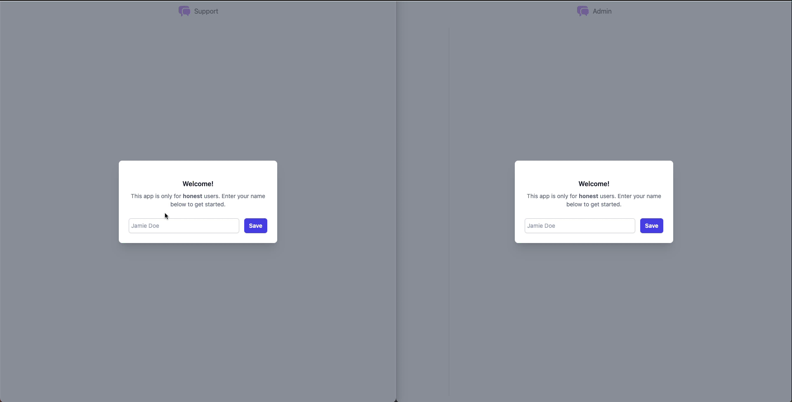

# Nx Convex Example

<p align="center">
  <picture>
    <source media="(prefers-color-scheme: dark)" srcset="https://raw.githubusercontent.com/nrwl/nx/master/images/nx-dark.svg">
    
  </picture>
</p>
<p align="center">
  <picture>
    <source media="(prefers-color-scheme: dark)" srcset="https://static-http.s3.amazonaws.com/logo/convex-logo-light.svg" width="600">
    <source media="(prefers-color-scheme: light)" srcset="https://static-http.s3.amazonaws.com/logo/convex-logo.svg" width="600">
    
  </picture>
</p>

## Introduction



This is an Nx workspace that uses [Convex](https://www.convex.dev/) as a sync platform to communicate with two different applications. The application `web` is an example of a customer chat support application. The `admin` application is for support engineers to respond to different threads from customers.

These apps use fingerprinting to quickly identify users without needing authentication. This way, you can open separate tabs for each app to test the functionality. Convex makes it easy to sync data between apps and users. Sending a message from a customer quickly appears in the thread for the admin and vice versa. The comment count in the threads sidebar for admins also automatically ticks up for each message added.

## First-time run

To run this example, you'll need to create a Convex account. This is free, easy and based on your GitHub login.

To get started, run the following command to setup the `convex` project for the first time:

```bash
npx nx dev convex
```

This will take you through the steps of logging in, creating an account if you don't already have one, and setting up a Convex project. When prompted, answer the setup questions like so:

```bash
? What would you like to configure? create a new project
? Project name: nx-convex-example
```

## Serving apps

The following tasks need to be run as separate processes to serve the Convex service and the two apps: `web` and `admin`:

```bash
npx nx serve web
npx nx serve admin
npx nx dev convex
```

Alternatively, you can run all of these tasks with a workspace-level task:

```bash
npx nx serve-demo workspace
```

Or you can run the Convex service with a single app using the `serve-with-backend` task:

```bash
npx nx serve-with-backend web

# or

npx nx serve-with-backend admin
```

## How to add Convex to your own Nx workspace

Adding Convex to your existing workspace is easy!

1) Install Convex: `npm add convex`
2) Generate a JS library: `npx nx g @nx/js convex --name convex --directory libs/convex`
3) In the `project.json` file, add a target for `convex dev`:

```text
"targets": {
    "dev": {
      "command": "convex dev"
    }
  }
```

4) Add a `convex.json` file to the root of your workspace that points to the `convex` project:

```json
{
  "functions": "libs/convex/src/lib/"
}
```

5) Visit Convex to learn more about [integrating with your favorite language or framework](https://docs.convex.dev/quickstarts)

## Useful links

Learn more about Nx:

- [Learn more about this workspace setup](https://nx.dev/getting-started/tutorials/react-monorepo-tutorial?utm_source=nx_project&utm_medium=readme&utm_campaign=nx_projects)
- [Learn about Nx on CI](https://nx.dev/ci/intro/ci-with-nx?utm_source=nx_project&utm_medium=readme&utm_campaign=nx_projects)
- [Releasing Packages with Nx release](https://nx.dev/features/manage-releases?utm_source=nx_project&utm_medium=readme&utm_campaign=nx_projects)
- [What are Nx plugins?](https://nx.dev/concepts/nx-plugins?utm_source=nx_project&utm_medium=readme&utm_campaign=nx_projects)

Learn more about Convex:

- [Learn more about Convex](https://www.convex.dev/)
- [Learn about how Convex integrates with your application](https://docs.convex.dev/quickstarts)

And join the Nx community:

- [Discord](https://go.nx.dev/community)
- [Follow us on X](https://twitter.com/nxdevtools) or [LinkedIn](https://www.linkedin.com/company/nrwl)
- [Our Youtube channel](https://www.youtube.com/@nxdevtools)
- [Our blog](https://nx.dev/blog?utm_source=nx_project&utm_medium=readme&utm_campaign=nx_projects)

